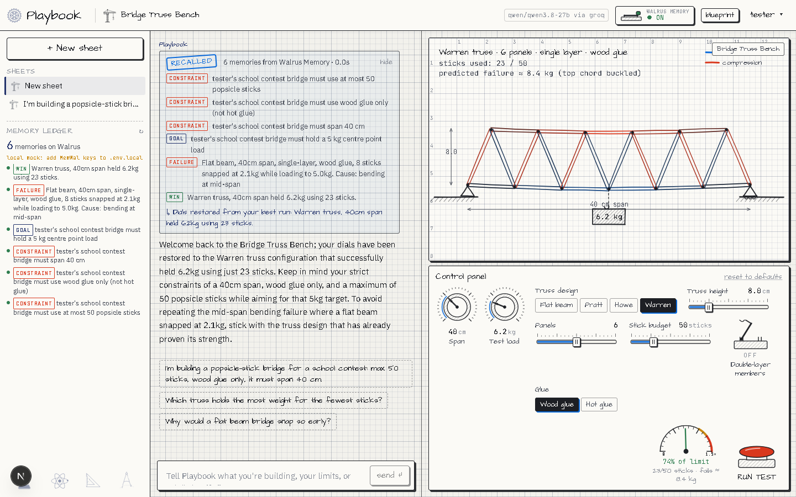

# Playbook: a what-if workbench that remembers you

**Live:** https://playbook-nu-six.vercel.app (pick any username + passcode; no email)

Playbook is a chatbot that runs simulations with you. You describe a real problem (a popsicle-stick bridge for a school contest, a checkout line that melts down at lunch, a solar setup that dies at 2 a.m.), and Playbook sets the dials on a hand-drawn workbench, runs the test, and explains what happened.

It uses **[Walrus Memory](https://github.com/MystenLabs/MemWal)** to remember each person across sessions and devices:

- **Constraints:** "Amara's bridge must use at most 50 sticks, wood glue only"
- **Best runs:** "Warren truss, 40cm span held 6.2kg using 23 sticks", with the exact dial settings
- **Failures:** "Flat beam snapped at 2.1kg. Cause: bending at mid-span"

When you open a new sheet, Playbook recalls these, **sets the dials to your best known configuration**, and won't suggest a design that already failed for you. A **memory kill switch** in the top bar turns all of this off, so you can compare the bot with and without memory.

Built for *Walrus Session 8: Chatbots That Remember*. LLM: **Qwen 3.8 27B on Groq** (open weights), and it can be switched to any OpenRouter or OpenAI-compatible model (including Ollama).



---

## How the memory works

| When | What happens | Code |
|---|---|---|
| New sheet (memory ON) | 5 focused `recall()` queries (constraints, best runs, failures, profile, recent) → dedupe → the best-scoring `[WIN]` memory's `params=` restores the dials → the model writes a welcome-back | `src/lib/memory.ts` `bootstrapMemories`, `src/app/api/bootstrap/route.ts` |
| Every chat turn | 2 `recall()` queries (your message + bench constraints) are injected into the system prompt as *data, not instructions*. The UI shows "recalled N memories" | `src/app/api/chat/route.ts` |
| You state a fact | The model calls the `remember` tool: one third-person sentence, tagged `[CONSTRAINT]`, `[GOAL]`, `[PREF]`, `[PROFILE]` or `[INSIGHT]` | `src/app/api/chat/route.ts` |
| A bench test finishes | Failures are saved as `[FAILURE]` (unless they repeat a recent one). Passes are saved as `[WIN]` only if they beat your best. Both include the dial settings | `src/app/api/memories/route.ts` |
| Memory OFF | No recall, no remember tools, default dials, generic greeting | everywhere `memoryOn` is checked |

Every memory is a single line of text, because that is what Walrus Memory embeds and searches:

```
[WIN · truss] Warren truss, 40cm span held 6.2kg using 23 sticks. score=6.2 params={"design":"warren","spanCm":40,...}
```

The tag and the `score=`/`params=` suffix let the app restore dials from recalled memory alone. There's no local cache of "best settings". Walrus Memory is the source of truth.

**Users and namespaces:** a username and passcode gives you the namespace `pb-<username>` on the app's shared Walrus Memory account. You can also **bring your own Walrus Memory account** (account ID + delegate key from [memory.walrus.xyz](https://memory.walrus.xyz)) at sign-up or in settings. Your memories then go to *your* account. Keys are stored AES-256-GCM encrypted.

## The workbenches

| Bench | Model |
|---|---|
| Bridge Truss | Pin-jointed truss solved by the method of joints, Euler buckling for compression members, glue-joint limits, popsicle-stick counting |
| Checkout Rush | Multi-lane checkout simulated second by second (Poisson arrivals, walkouts, express lane) with seeded randomness, so every configuration faces the same customers |
| Off-Grid Solar | 10-minute energy balance over 1–3 days: battery, depth of discharge, panels, clouds, night load, load-shedding |
| Launch & Swing | Projectile with quadratic drag on Earth/Moon/Mars, and a non-linear pendulum (numerically integrated) |
| Outbreak | SIR epidemic in quarter-day steps: R0, vaccination, distancing from a chosen day, hospital beds vs demand, with a 200-person crowd that changes colour |
| Stopping Distance | Reaction distance + braking distance (v²/2a) with road surface, worn tyres, ABS, slope and phone distraction; a child runs out and you see the impact speed |
| Savings Goal | Month-by-month saving with compound interest, yearly raises, inflation (goal in today's money) and an emergency withdrawal |
| Bottle Rocket | Water rocket: thrust 2A(P−Patm), adiabatic air expansion, quadratic drag, fins vs tumbling, apogee vs target |

Each sim is a standalone HTML file in `public/sims/`, running in a sandboxed iframe (`sandbox="allow-scripts"`). It talks to the app over `postMessage` (`src/lib/protocol.ts`), so a generated sim can follow the same contract.

## AI-built benches

If none of the benches fit, describe your idea ("a rainwater tank for my house: roof size, rainfall, daily use") in the bench picker, or just tell the chat. The model calls `build_bench` and a new simulation appears with its own dials, in about 10–40 seconds.

How it stays reliable with a 27B open model (`src/lib/sim-gen.ts`, `src/lib/sim-check.ts`):

1. **One contract, one worked example.** The model writes a JSON spec (dials, brief, pass rule) and a small canvas script against the same protocol and drawing kit as the hand-built sims.
2. **Strict parsing.** Dials are clamped into valid ranges and the code is compiled (`vm.Script`) to catch syntax errors with the exact line.
3. **Headless smoke run.** The script runs in a Node `vm` with a fake canvas and clock and a 1.5 s CPU limit. It must start, publish metrics and finish a test, so crashes and infinite loops never reach a browser. The vm gets no host objects (null-prototype global, string code generation disabled), so the script can't reach `process`.
4. **Physics review.** A second short model call hand-checks the sim's own result for its default settings. It caught a shelf bench reporting 23 mm of sag where the beam formula gives about 2.3 mm (a unit bug), so that bench gets rewritten.
5. **Repair loop.** If a bench still crashes in the browser (`SIM_ERROR`, or no result within 25 s), the error goes back to the model, which fixes its own code, at most twice. In the chat, `revise_bench` changes a bench on request.

### Sprites: icons as game assets

Benches draw real objects instead of boxes. The drawing kit (`public/sims/bench.js`) has three sprite helpers:

- `D.icon(name, x, y, size, {color, flip, rotate, label})` draws one of ~900 icons from `public/sims/icons.js`: a "physical world" subset of [Font Awesome Free](https://fontawesome.com) (people, animals, vehicles, buildings, food, energy, weather, tools, money, medical…) plus hand-drawn extras Font Awesome doesn't have (elephant, popsicle stick, walrus). The pack loads lazily the first time a sim draws an icon.
- `D.person(x, y, h, {pose})` draws a stick figure: stand, walk, run, wave, sit, carry, lie, fall.
- `D.token(label, x, y, size)` draws a labelled circle for anything with no icon. An unknown icon name falls back to a token, so a typo never crashes a sim.

The AI never sees all 900 names. `src/lib/icons.ts` searches an icon map (names, labels, Font Awesome's search terms and our aliases such as `coffee → mug-hot`, `lift → elevator`) for the words in the request and puts the ~20 best matches in the prompt. The full map is in [docs/ICONS.md](docs/ICONS.md). Regenerate everything with `node scripts/build-icons.mjs`.

On a phone, every sim is laid out at 500 px wide and scaled down, so labels shrink instead of colliding.

Generated code only ever runs in the sandboxed iframe (opaque origin, no cookies) behind a CSP that blocks network access. Each bench belongs to one person. Building one is saved to Walrus Memory as a `[SIM]` memory, so the bot remembers what you built.

## Landing page and email list

Signed-out visitors get a landing page (`src/components/Landing.tsx`, also at `/welcome`) explaining the app, Walrus Memory and the use cases. A dotted arrow follows your scroll through the sections and the diagrams drop into place as they come into view. The email sign-up (landing page and the About tab in settings) stores addresses in the `subscribers` table via `POST /api/subscribe`. Click the Playbook logo in the app for About, account and theme settings.

## Run it locally

Requirements: Node 20.9+ and pnpm.

```bash
git clone <this repo> playbook && cd playbook
pnpm install
cp .env.example .env.local
```

Fill in `.env.local`:

| Variable | Where to get it |
|---|---|
| `GROQ_API_KEY` | [console.groq.com](https://console.groq.com/keys). The free tier works for trying it alone, but one key is shared by everyone using the app (about 8k tokens and 1k output tokens per minute). Use the Dev tier for real users |
| `MEMWAL_ACCOUNT_ID`, `MEMWAL_PRIVATE_KEY` | [memory.walrus.xyz](https://memory.walrus.xyz): create an account and a delegate key |
| `MEMWAL_SERVER_URL` | `https://relayer.memory.walrus.xyz` (mainnet) or `https://relayer-staging.memory.walrus.xyz` (testnet) |
| `AUTH_SECRET` | any long random string: `openssl rand -hex 32` |
| `DATABASE_URL` | optional locally. Leave it empty to use a JSON file in `.data/`. Use Neon Postgres in production |

```bash
pnpm dev   # http://localhost:3000
```

Without MemWal keys, the app falls back to the SDK's in-memory `MemWalMock`, labelled "local mock" in the sidebar, so you can try the UI first.

### Switching the model

```bash
LLM_PROVIDER=groq               LLM_MODEL=qwen/qwen3.8-27b
LLM_PROVIDER=openrouter         LLM_MODEL=qwen/qwen-2.5-72b-instruct   OPENROUTER_API_KEY=...
LLM_PROVIDER=openai-compatible  LLM_MODEL=qwen2.5:14b  OPENAI_COMPATIBLE_BASE_URL=http://localhost:11434/v1   # Ollama
```

## Deploy (Vercel + Neon)

1. Push to GitHub and import the repo in Vercel.
2. Add a Neon Postgres database from the Vercel Marketplace (it sets `DATABASE_URL`). Tables are created automatically on first request.
3. Add `GROQ_API_KEY`, `MEMWAL_ACCOUNT_ID`, `MEMWAL_PRIVATE_KEY`, `MEMWAL_SERVER_URL` and `AUTH_SECRET` in the project's environment variables.
4. Deploy.

## Project layout

```
src/lib/memory.ts        Walrus Memory: client per user, tagged memory format, recall/remember, bootstrap
src/lib/sims.ts          Bench registry (dial specs shared by the UI and the model's tools)
src/lib/prompts.ts       System prompt (memory ON vs OFF)
src/lib/llm.ts           Provider switch (Groq / OpenRouter / OpenAI-compatible)
src/lib/sim-gen.ts       AI-built benches: prompt contract, parsing, physics review, retry loop
src/lib/sim-check.ts     Headless smoke run of generated sims in an isolated vm
src/lib/sim-doc.ts       Wraps generated code in a CSP-locked document for the sandboxed iframe
src/lib/icons.ts         Icon map search: which sprites fit a bench request
scripts/build-icons.mjs  Builds the sprite pack, icon map and UI icons from Font Awesome Free
src/app/api/chat         Streaming chat: recall → model + tools (set_dials, remember, recall, switch_bench, build_bench, revise_bench)
src/app/api/sims         Build / fetch / repair AI-built benches
src/app/api/bootstrap    New sheet: recall, restore dials, welcome-back
src/app/api/memories     Bench results → memory; memory ledger
public/sims/*.html       Hand-built simulations + bench.js drawing kit + icons.js sprite pack
src/components/Landing.tsx  Public landing page
docs/FRICTION_LOG.md     Bugs and friction found while integrating Walrus Memory with an open model
```

## License

MIT. Icons: [Font Awesome Free](https://fontawesome.com) by Fonticons, Inc., licensed [CC BY 4.0](https://fontawesome.com/license/free) (the elephant, popsicle stick and walrus sprites are our own).
